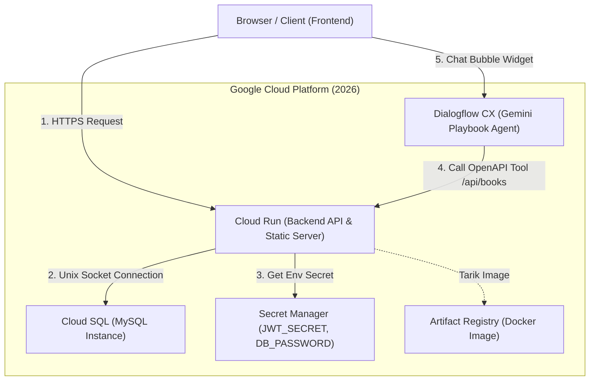

# LAPORAN PROJECT CLOUD COMPUTING (TA 2025/2026)
## PENGEMBANGAN DAN MIGRASI APLIKASI E-BOOK STORE DENGAN BOT CHATBOT DILENGKAPI DATA GROUNDING DI GOOGLE CLOUD PLATFORM (GCP)

---

## 1. HALAMAN COVER

*   **Judul Project:** Penerapan Serverless Cloud Run, Cloud SQL MySQL, dan Gemini Generative Agent Platform (Dialogflow CX) untuk Aplikasi E-Book Store
*   **Mata Kuliah:** Komputasi Awan (Cloud Computing)
*   **Tahun Akademik:** 2025/2026
*   **Program Studi:** Teknik Elektro / Teknologi Informasi
*   **Kelas:** BM4A

### Disusun Oleh:
1.  **Muhamad Nur Alif** (NIM: 2303421004)
2.  **Ilham Wibowo** (NIM: 2303421009)

---

## 2. URAIAN / PENJELASAN PROJECT

### A. Latar Belakang
Aplikasi **E-Book Store** awalnya merupakan aplikasi web lokal berbasis Node.js Express yang terhubung ke database MySQL offline (XAMPP). Pada arsitektur lokal tersebut terdapat kendala skalabilitas, pemeliharaan server database fisik, serta keterbatasan chatbot AI bawaan lokal yang membebani kinerja server backend. 

Melalui project Komputasi Awan ini, kami memigrasikan seluruh arsitektur aplikasi ke infrastruktur cloud modern **Google Cloud Platform (GCP)** menggunakan pendekatan *serverless* dan *managed database*. Kami juga mengintegrasikan agen AI percakapan cerdas yang mampu menjawab pertanyaan ketersediaan buku secara dinamis dengan teknik **Data Grounding** (menghubungkan API database lokal langsung ke model LLM di awan).

### B. Arsitektur Sistem (Target GCP)
Sistem ini menggunakan arsitektur cloud terdistribusi dengan komponen sebagai berikut:
1.  **Google Cloud Run (Serverless Compute):** Menjalankan container Docker berisi backend Node.js Express dan menyajikan file frontend (HTML, CSS, JS) secara serverless (menskala otomatis dari 0 hingga banyak instance sesuai traffic).
2.  **Google Cloud SQL (MySQL Managed Database):** Menyimpan data buku, transaksi pembelian, dan peminjaman secara aman. Terhubung ke Cloud Run menggunakan Unix Socket / Cloud SQL Proxy sehingga tidak perlu mengekspos IP publik database ke internet.
3.  **Gemini Enterprise Agent Platform / Dialogflow CX (Generative Agent):** Menggunakan model **Gemini 2.0 Flash** yang dikonfigurasi menggunakan **Generative Playbook** dan dilengkapi dengan custom **OpenAPI Tool** untuk memanggil database API dan menjawab pertanyaan pengguna secara dinamis.
4.  **Google Secret Manager (Keamanan Secret):** Menyimpan password database dan JWT Secret key agar tidak tersimpan sebagai *plaintext* di kode program atau variabel environment mentah.
5.  **Google Artifact Registry & Cloud Build:** Bertindak sebagai repositori penyimpanan container image dan pipeline CI/CD serverless untuk melakukan *build* container dari source code secara otomatis.



---

## 3. LANGKAH-LANGKAH PEMBUATAN PROJECT

### Tahap 1: Setup GCP Project & Aktivasi API
1.  Membuat project baru bernama `ebookstore-uas-2026-498209` melalui GCP Console.
2.  Mengaktifkan API kunci yang dibutuhkan melalui Cloud Shell:
    ```bash
    gcloud services enable \
      run.googleapis.com \
      sqladmin.googleapis.com \
      aiplatform.googleapis.com \
      secretmanager.googleapis.com \
      artifactregistry.googleapis.com \
      cloudbuild.googleapis.com \
      dialogflow.googleapis.com
    ```

### Tahap 2: Setup Database di Cloud SQL
1.  Membuat instance Cloud SQL MySQL v8.0 dengan spesifikasi `db-g1-small` di region `asia-southeast2` (Jakarta) bernama `ebookstore`.
2.  Membuat database baru di dalamnya dengan nama `ebookstore_db`.
3.  Membuat user database bernama `db_user` dengan password `Alip123_`.
4.  Mengunggah backup schema database lokal (`db_backup.sql`) ke Cloud Storage Bucket, lalu mengimpor file SQL tersebut ke database `ebookstore_db` di Cloud SQL.

### Tahap 3: Penyesuaian Kode Backend Node.js
1.  **Koneksi UNIX Socket (Unix Domain Socket):** Mengubah inisialisasi pool di `backend/database.js` agar mendeteksi socket path dari Cloud Run secara otomatis:
    ```javascript
    if (process.env.INSTANCE_CONNECTION_NAME) {
      dbConfig.socketPath = `/cloudsql/${process.env.INSTANCE_CONNECTION_NAME}`;
    }
    ```
2.  **Otentikasi Cleartext Plugin:** Menambahkan opsi `enableCleartextPlugin: true` pada `dbConfig` untuk memungkinkan transfer password aman via socket.
3.  **Penyusunan API Endpoint Webhook:** Membuat endpoint baru `/api/dialogflow-webhook` di `backend/server.js` untuk melayani format request dari Dialogflow CX/ES.

### Tahap 4: Manajemen Kunci Rahasia dengan Secret Manager
1.  Membuat secret bernama `JWT_SECRET` untuk menyimpan kunci token JWT.
2.  Membuat secret bernama `DB_PASSWORD` dengan nilai kata sandi database (`Alip123_`).
3.  Memberikan hak akses IAM role **Secret Manager Secret Accessor** kepada Service Account Cloud Run agar dapat membaca secret tersebut saat runtime.

### Tahap 5: Dockerization & Deployment via Cloud Build
1.  Membuat berkas `Dockerfile` dan `.dockerignore` untuk memaketkan kode frontend dan backend.
2.  Membuat Docker Repository bernama `ebookstore-repo` di Artifact Registry.
3.  Mengompilasi dan mengunggah image Docker ke cloud:
    ```bash
    gcloud builds submit --tag asia-southeast2-docker.pkg.dev/ebookstore-uas-2026-498209/ebookstore-repo/ebookstore-app:latest
    ```
4.  Men-deploy container ke Cloud Run:
    ```bash
    gcloud run deploy ebookstore-app \
      --image=asia-southeast2-docker.pkg.dev/ebookstore-uas-2026-498209/ebookstore-repo/ebookstore-app:latest \
      --region=asia-southeast2 \
      --allow-unauthenticated \
      --add-cloudsql-instances=ebookstore-uas-2026-498209:asia-southeast2:ebookstore \
      --set-env-vars=DB_HOST=localhost,DB_USER=db_user,DB_NAME=ebookstore_db,INSTANCE_CONNECTION_NAME=ebookstore-uas-2026-498209:asia-southeast2:ebookstore \
      --set-secrets=JWT_SECRET=JWT_SECRET:latest,DB_PASSWORD=DB_PASSWORD:latest
    ```
    *   *Output URL Cloud Run:* `https://ebookstore-app-1047421347297.asia-southeast2.run.app`

### Tahap 6: Integrasi Agent Chatbot & Data Grounding (Dialogflow CX)
1.  Membuat **Generative Agent** di Dialogflow CX Console di wilayah `asia-southeast2`.
2.  Membuat custom **OpenAPI Tool** bernama `get_books_tool` dengan skema spesifikasi OpenAPI 3.0.0 JSON yang menunjuk ke API endpoint `https://ebookstore-app-1047421347297.asia-southeast2.run.app/api/books`.
3.  Mengaitkan `get_books_tool` ke **Default Generative Playbook**.
4.  Menulis instruksi (prompt) natural language agar model Gemini memicu tool tersebut saat user menanyakan informasi buku:
    *   *Instruksi:* *"Jika pengguna bertanya tentang jumlah buku atau katalog buku, Anda wajib menggunakan `${TOOL:get_books_tool}` dan menghitung hasilnya secara dinamis."*
5.  Memasang script widget `<df-messenger>` pada file `index.html` dengan konfigurasi `storage-option="none"` dan listener `df-chat-open-changed` untuk otomatis me-reset session saat gelembung chat ditutup oleh user.

---

## 4. HASIL

### A. Tampilan Website Utama (Cloud Run)
Website E-Book Store telah dideploy secara online dan dapat diakses publik melalui tautan:
🔗 **[https://ebookstore-app-1047421347297.asia-southeast2.run.app/](https://ebookstore-app-1047421347297.asia-southeast2.run.app/)**

Semua fungsi frontend (pembelian, peminjaman buku, navbar, login, dan registrasi) telah bekerja penuh secara serverless.

### B. Pengujian Chatbot AI Gemini (Dialogflow CX Grounding)
Ketika chatbot ditanyakan mengenai informasi buku, agent tidak lagi menjawab *"tidak tahu"*, melainkan sukses mengeksekusi tool API ke Cloud SQL dan memberikan jawaban akurat:
*   **Pertanyaan User:** *"ada berapa buku saat ini"*
*   **Respon Chatbot:** *"Saat ini terdapat 11 judul buku yang tersedia di E-Book Store kami. Berikut adalah beberapa koleksi teratas kami..."* (Data diambil real-time dari database Cloud SQL MySQL).

*(Sisipkan Screenshot bukti chat & tampilan web di sini)*

---

## 5. LINK VIDEO

*   **Link Video YouTube (Proses Deploy GCP):** `[Masukkan Link Video YouTube Anda di Sini]`
*   **Deskripsi Video:** Video ini mendemonstrasikan langkah-langkah migrasi aplikasi dari lokal (XAMPP) ke GCP, mencakup pembuatan database Cloud SQL, build image kontainer via Cloud Build, deploy ke Cloud Run, penyetelan Secret Manager, dan demo fitur chatbot Gemini Dialogflow CX.

---

## 6. POSTER

*(Sisipkan File Gambar Poster Project UAS Anda di Sini)*
*   **Deskripsi Poster:** Poster memuat judul project, nama anggota kelompok (Alif & Ilham), kelas, diagram arsitektur cloud GCP (Cloud Run, Cloud SQL, Dialogflow CX), serta kelebihan teknologi arsitektur serverless (skalabilitas tinggi, tanpa pemeliharaan server fisik, dan responsif AI).

---

## 7. CARA MENJALANKAN PROJECT

### A. Cara Menjalankan Secara Lokal (Development)
1.  Pastikan Anda telah menginstal Node.js versi 18 atau ke atas di komputer Anda.
2.  Buka terminal di folder project, masuk to folder backend:
    ```bash
    cd backend
    ```
3.  Salin file `.env.example` menjadi `.env` lalu lengkapi isinya:
    ```env
    PORT=5000
    DB_HOST=127.0.0.1
    DB_PORT=3306
    DB_USER=root
    DB_PASSWORD=
    DB_NAME=ebookstore_db
    JWT_SECRET=yourkey_here
    GEMINI_API_KEY=yourkey_here
    ```
4.  Jalankan XAMPP MySQL lokal Anda.
5.  Jalankan perintah install dependensi dan start server:
    ```bash
    npm install
    npm start
    ```
6.  Buka web browser di alamat `http://localhost:5000`.

### B. Cara Mengakses di Produksi (Cloud Run)
Cukup buka tautan web produksi yang disajikan oleh Google Cloud Run melalui peramban internet apa pun tanpa perlu melakukan instalasi:
🔗 **[https://ebookstore-app-1047421347297.asia-southeast2.run.app/](https://ebookstore-app-1047421347297.asia-southeast2.run.app/)**

---

## 8. REFERENSI / DAFTAR PUSTAKA

1.  Google Cloud. (2026). *Cloud Run Documentation*. Diakses dari https://cloud.google.com/run/docs
2.  Google Cloud. (2026). *Cloud SQL for MySQL Guide*. Diakses dari https://cloud.google.com/sql/docs/mysql
3.  Google Cloud. (2026). *Dialogflow CX - Playbooks & Tools Overview*. Diakses dari https://cloud.google.com/dialogflow/cx/docs/concept/playbook
4.  Docker. (2025). *Containerizing Node.js Web Applications*. Diakses dari https://docs.docker.com/language/nodejs/
5.  MySQL. (2025). *MySQL 8.0 Reference Manual*. Oracle. Diakses dari https://dev.mysql.com/doc/refman/8.0/en/
