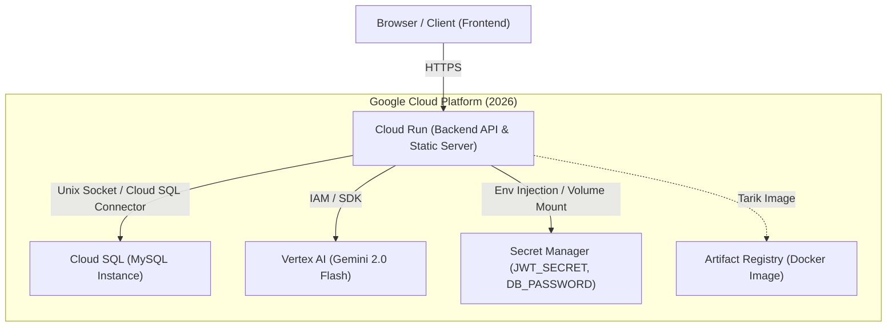
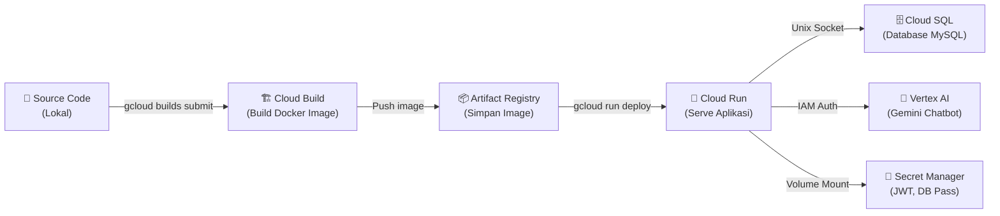

# Rencana Migrasi ke Google Cloud Platform (GCP 2026)
## Database, Vertex AI Chatbot, dan Cloud Run Deployment

Dokumen ini berisi Product Requirement Document (PRD) dan langkah-langkah implementasi teknis untuk memindahkan aplikasi **E-Book Store** Anda dari lingkungan lokal (XAMPP MySQL) ke infrastruktur cloud modern **Google Cloud Platform (GCP)** menggunakan standard industri tahun 2026.

---

## 1. Arsitektur Sistem (Target GCP 2026)

Berikut adalah visualisasi arsitektur setelah migrasi ke GCP. Server Node.js akan dideploy di **Cloud Run**, terhubung secara aman ke **Cloud SQL (MySQL)** menggunakan Unix Socket, dan mengakses **Vertex AI** via IAM service account tanpa API key eksternal.



---

## 2. Ringkasan Kebutuhan Layanan GCP

| Layanan GCP | Fungsi | Keunggulan & Konteks Tahun 2026 |
| :--- | :--- | :--- |
| **Cloud Run** | Menjalankan Backend Node.js & Menyajikan Frontend | Serverless, autoscaling dari 0, bayar sesuai penggunaan, mendukung HTTP/2 & HTTPS bawaan. |
| **Cloud SQL for MySQL** | Database Relasional Pengganti MySQL XAMPP | Managed database, backup otomatis, keamanan tingkat tinggi, kompatibel dengan mysql2 Node.js. |
| **Vertex AI** | Layanan AI Chatbot Rekomendasi Buku | Integrasi model **Gemini 2.0 Flash** (Model default super cepat & murah di 2026) menggunakan Application Default Credentials (ADC). |
| **Secret Manager** | Menyimpan password database & JWT Secret | Menghilangkan penyimpanan secret dalam bentuk plaintext di file `.env` di production. |
| **Artifact Registry** | Menyimpan Docker Container Image | Pengganti Container Registry lama (GCR) yang sudah fully deprecated di 2026. |

---

## 3. Langkah-Langkah Migrasi (Lengkap & Bertahap)

### Tahap 1: Setup GCP Console & API

1. **Buat Project & Billing**:
   - Buka [Google Cloud Console](https://console.cloud.google.com/).
   - Buat project baru, misalnya: `ebookstore-uas-2026`.
   - Pastikan billing akun Anda aktif.
2. **Aktifkan API Kunci**:
   Jalankan perintah berikut menggunakan Google Cloud SDK (`gcloud`) di terminal lokal Anda, atau aktifkan secara manual melalui GCP Console:
   ```bash
   gcloud services enable \
     run.googleapis.com \
     sqladmin.googleapis.com \
     aiplatform.googleapis.com \
     secretmanager.googleapis.com \
     artifactregistry.googleapis.com \
     cloudbuild.googleapis.com
   ```

---

### Tahap 2: Migrasi Database (XAMPP MySQL ke Cloud SQL)

1. **Membuat Instance Cloud SQL**:
   - Masuk ke menu **SQL** > klik **Create Instance** > pilih **MySQL**.
   - Gunakan versi **MySQL 8.0** (atau sesuaikan dengan database lokal Anda).
   - Set **Region** ke `asia-southeast2` (Jakarta) untuk meminimalkan latency.
   - Atur spesifikasi instance (untuk kebutuhan UTS/UAS, tipe **Shared core (db-f1-micro / db-g1-small)** sudah cukup untuk menghemat biaya).
   - Buat user database baru (misalnya `db_user`) dan catat password-nya.
2. **Membuat Database**:
   - Di tab **Databases** pada instance Cloud SQL, buat database baru dengan nama `ebookstore_db`.
3. **Ekspor Data dari XAMPP Lokal**:
   - Buka command prompt di Windows (di folder XAMPP mysql) dan jalankan:
     ```bash
     mysqldump -u root -p ebookstore_db > db_backup.sql
     ```
4. **Impor Data ke Cloud SQL**:
   - Buat Cloud Storage Bucket baru di GCP (misalnya `gs://ebookstore-temp-backups`).
   - Upload file `db_backup.sql` ke bucket tersebut.
   - Masuk ke halaman detail instance **Cloud SQL** > Klik **Import**.
   - Pilih file `db_backup.sql` dari Cloud Storage bucket Anda, lalu pilih database tujuan `ebookstore_db`.

---

### Tahap 3: Penyesuaian Kode Aplikasi (Node.js)

Untuk mendukung koneksi lokal (XAMPP) maupun produksi (Cloud SQL di Cloud Run), ubah berkas koneksi database Anda untuk mendeteksi mode koneksi secara dinamis.

#### 1. Perubahan pada [backend/database.js](file:///C:/Users/HP/Documents/semester_6/gcp/project%20UTS%20Web/backend/database.js)

Ubah bagian inisialisasi pool agar menggunakan **Unix Sockets** jika variabel `INSTANCE_CONNECTION_NAME` terdeteksi di lingkungan Cloud Run:

```diff
-const pool = mysql.createPool({
-  host: process.env.DB_HOST || 'localhost',
-  user: process.env.DB_USER || 'root',
-  password: process.env.DB_PASSWORD || '',
-  database: process.env.DB_NAME || 'ebookstore_db',
-  waitForConnections: true,
-  connectionLimit: 10,
-  queueLimit: 0
-});
+const dbConfig = {
+  user: process.env.DB_USER || 'root',
+  password: process.env.DB_PASSWORD || '',
+  database: process.env.DB_NAME || 'ebookstore_db',
+  waitForConnections: true,
+  connectionLimit: 10,
+  queueLimit: 0
+};
+
+// Deteksi koneksi Cloud SQL via Unix Sockets di Cloud Run
+if (process.env.INSTANCE_CONNECTION_NAME) {
+  dbConfig.socketPath = `/cloudsql/${process.env.INSTANCE_CONNECTION_NAME}`;
+  console.log(`[Database] Terhubung ke Cloud SQL via socket: /cloudsql/${process.env.INSTANCE_CONNECTION_NAME}`);
+} else {
+  dbConfig.host = process.env.DB_HOST || 'localhost';
+  dbConfig.port = process.env.DB_PORT || 3306;
+  console.log(`[Database] Terhubung secara lokal via TCP: ${dbConfig.host}:${dbConfig.port}`);
+}
+
+const pool = mysql.createPool(dbConfig);
```

#### 2. Perubahan pada [backend/server.js](file:///C:/Users/HP/Documents/semester_6/gcp/project%20UTS%20Web/backend/server.js) (Rekomendasi Model AI 2026)

Sesuaikan model AI ke **gemini-2.0-flash** untuk mendapatkan performa chatbot yang lebih pintar, responsif, dan hemat biaya di tahun 2026.

```diff
     const vertexAI = new VertexAI({ project: project, location: location });
-    // Menggunakan gemini-2.0-flash-001 sebagai model default di Vertex AI
-    aiModel = vertexAI.getGenerativeModel({ model: 'gemini-1.5-flash-002' });
-    console.log('Vertex AI (Gemini 1.5 Flash) berhasil diinisialisasi.');
+    // Menggunakan model Gemini 2.0 Flash yang lebih mutakhir di tahun 2026
+    aiModel = vertexAI.getGenerativeModel({ model: 'gemini-2.0-flash-001' });
+    console.log('Vertex AI (Gemini 2.0 Flash) berhasil diinisialisasi.');
```

#### 3. Pilihan Arsitektur Integrasi Chatbot (GCP Gemini Agent Platform 2026)

Terdapat 2 opsi utama untuk mengimplementasikan Chatbot AI pada website Anda menggunakan layanan Google Cloud terbaru di tahun 2026 (di mana **Vertex AI Agent Builder** kini terintegrasi di bawah naungan **Gemini Enterprise Agent Platform**):

##### Opsi A: Custom UI + Backend API (Rekomendasi UAS / Saat Ini Terpasang)
Opsi ini mempertahankan desain antarmuka chatbox kustom yang sudah ada di frontend, dan menggunakan backend Node.js Anda sebagai jembatan ke Vertex AI.

1. **Frontend ([script.js](file:///C:/Users/HP/Documents/semester_6/gcp/project%20UTS%20Web/script.js))**: Mengirim pesan ke endpoint internal `/api/chat`.
2. **Backend ([backend/server.js](file:///C:/Users/HP/Documents/semester_6/gcp/project%20UTS%20Web/backend/server.js))**: Menerima pesan, mengambil daftar buku aktif dari MySQL database secara real-time, merakit prompt konteks, dan memanggil Vertex AI menggunakan SDK `@google/genai` dengan model `gemini-2.0-flash-001`.
3. **Konfigurasi API di Server**:
   ```javascript
   const { GoogleGenAI } = require('@google/genai');
   const ai = new GoogleGenAI({ project: 'PROJECT_ID', location: 'us-central1' });
   // panggil ai.models.generateContent(...)
   ```

##### Opsi B: Instant Web Widget (Gemini Enterprise Agent / Dialogflow CX)
Opsi ini memindahkan pengelolaan UI chat dan pencarian katalog dokumen sepenuhnya ke layanan cloud GCP. Anda tidak memerlukan kode backend untuk chatbot Anda.

1. **GCP Agent Studio**: Buat agen cerdas secara visual di GCP Console (Gemini Enterprise Agent Platform).
2. **Data Store (Grounding RAG)**: Upload daftar katalog buku (PDF/TXT/JSON) ke Cloud Storage dan hubungkan sebagai Data Store agar agen menjawab hanya berdasarkan katalog buku yang Anda sediakan.
3. **Embed HTML**: Hasilkan kode widget di GCP Console, lalu tempelkan script di [index.html](file:///C:/Users/HP/Documents/semester_6/gcp/project%20UTS%20Web/index.html) tepat sebelum tag `</body>`:
   ```html
   <script src="https://www.gstatic.com/dialogflow-console/fast/messenger-cx/bootstrap.js?v=1"></script>
   <df-messenger
     df-cx="true"
     location="us-central1"
     chat-title="E-Book Store Agent"
     agent-id="YOUR_AGENT_ID"
     language-code="id">
   </df-messenger>
   ```
4. **Kelebihan**: Mengurangi beban server backend, pencarian dokumen (RAG) dioptimalkan secara otomatis oleh mesin pencari Google, dan interface chat melayang sudah siap pakai tanpa merancang UI CSS manual.

---

### Tahap 4: Mengatur Keamanan dengan IAM & Secret Manager

#### 1. Konfigurasi Secret Manager
Jangan menyimpan token JWT dan password database di env plain-text. 
- Buat secret bernama `JWT_SECRET` di GCP Secret Manager, masukkan nilainya.
- Buat secret bernama `DB_PASSWORD` di GCP Secret Manager, masukkan password user Cloud SQL Anda.

#### 2. Konfigurasi IAM Service Account
Cloud Run memerlukan hak akses untuk membaca Secret Manager dan melakukan panggilan API Vertex AI:
1. Secara default, Cloud Run menggunakan **Compute Engine Default Service Account** (`PROJECT_NUMBER-compute@developer.gserviceaccount.com`).
2. Masuk ke halaman **IAM & Admin** > **IAM** di GCP Console.
3. Edit service account tersebut dan tambahkan role berikut:
   - **Secret Manager Secret Accessor** (`roles/secretmanager.secretAccessor`)
   - **Vertex AI User** (`roles/aiplatform.user`)
   - **Cloud SQL Client** (`roles/cloudsql.client`)

---

### Tahap 5: Deployment ke Cloud Run

Kami telah membuat berkas [Dockerfile](file:///C:/Users/HP/Documents/semester_6/gcp/project%20UTS%20Web/Dockerfile) dan [.dockerignore](file:///C:/Users/HP/Documents/semester_6/gcp/project%20UTS%20Web/.dockerignore) di direktori utama Anda. Gunakan berkas ini untuk proses build.

#### 1. Buat Docker Repository di Artifact Registry
```bash
gcloud artifacts repositories create ebookstore-repo \
    --repository-format=docker \
    --location=asia-southeast2 \
    --description="Repository Docker untuk E-Book Store"
```

#### 2. Build Container Image menggunakan Cloud Build
Anda tidak perlu menginstal Docker secara lokal. Kirim kode langsung ke Google Cloud Build untuk dibuatkan container image-nya:
```bash
gcloud builds submit --tag asia-southeast2-docker.pkg.dev/ebookstore-uas-2026-498209/ebookstore-repo/ebookstore-app:latest
```
*(Ganti `ebookstore-uas-2026-498209` dengan Project ID Anda yang sebenarnya)*.

#### 3. Deploy Image ke Cloud Run
Jalankan perintah deploy berikut. Perintah ini sekaligus mengaitkan instance Cloud SQL dan meng-inject password dari Secret Manager secara aman:

```bash
gcloud run deploy ebookstore-app \
  --image=asia-southeast2-docker.pkg.dev/ebookstore-uas-2026-498209/ebookstore-repo/ebookstore-app:latest \
  --region=asia-southeast2 \
  --allow-unauthenticated \
  --add-cloudsql-instances=ebookstore-uas-2026-498209:asia-southeast2:ebookstore \
  --set-env-vars=DB_HOST=localhost,DB_USER=db_user,DB_NAME=ebookstore_db,GCP_PROJECT_ID=ebookstore-uas-2026-498209,GCP_LOCATION=asia-southeast2,INSTANCE_CONNECTION_NAME=ebookstore-uas-2026-498209:asia-southeast2:ebookstore \
  --set-secrets=JWT_SECRET=JWT_SECRET:latest,DB_PASSWORD=DB_PASSWORD:latest
```

---

## 4. Saran & Best Practices GCP (Konteks Tahun 2026)

1. **Keamanan Maksimal Tanpa Kunci API (Keyless Authentication)**:
   - Hindari membuat service account JSON Key dan menyimpannya di dalam container. Di tahun 2026, standard GCP mewajibkan penggunaan **Workload Identity** atau **Application Default Credentials (ADC)** bawaan Cloud Run untuk mengidentifikasi container secara otomatis ke Vertex AI dan Cloud SQL.
2. **Koneksi Cloud SQL via UNIX Socket**:
   - Selalu gunakan opsi `--add-cloudsql-instances` pada Cloud Run. Opsi ini secara otomatis mengaktifkan proxy internal yang membuat database Cloud SQL Anda dapat diakses melalui berkas lokal socket `/cloudsql/INSTANCE_CONNECTION_NAME` di dalam container. Dengan ini, database Anda **tidak memerlukan IP Publik yang terbuka** ke internet.
3. **Optimasi Biaya Cloud Run (Scale to Zero)**:
   - Secara default, Cloud Run memiliki fitur **Minimum Instances = 0**. Jika tidak ada traffic, Cloud Run akan mematikan semua instance sehingga Anda tidak dikenakan biaya compute sama sekali. Ini sangat ideal untuk project tugas kuliah/UTS/UAS.
4. **Gunakan Vertex AI SDK Versi Terbaru**:
   - Package `@google-cloud/vertexai` versi `1.12.0+` yang telah terpasang di `package.json` Anda merupakan versi terbaru yang mendukung model teranyar Gemini 2.0/2.5. Hindari penggunaan API Key dari Google AI Studio (`GEMINI_API_KEY`) di production, melainkan gunakan otentikasi IAM GCP bawaan.
5. **Database Auto-Migration**:
   - Sebelum mendeploy versi baru, jalankan migration database terlebih dahulu. Anda dapat menjalankan script migrasi secara manual dari terminal lokal yang terhubung ke Cloud SQL Auth Proxy, atau menjadwalkannya di **Cloud Build** sebelum proses deploy.

---

## 5. Quick Reference: Semua Command Build & Deploy

> **⚠️ PENTING**: Ganti `ebookstore-uas-2026-498209` dengan **Project ID** GCP lo yang sebenarnya di semua command di bawah ini.

### Step 0 — Set Project & Login
```bash
# Login ke GCP (buka browser untuk autentikasi)
gcloud auth login

# Set project default
gcloud config set project ebookstore-uas-2026-498209

# Set region default
gcloud config set run/region asia-southeast2
```

### Step 1 — Aktifkan Semua API yang Dibutuhkan
```bash
gcloud services enable \
  run.googleapis.com \
  sqladmin.googleapis.com \
  aiplatform.googleapis.com \
  secretmanager.googleapis.com \
  artifactregistry.googleapis.com \
  cloudbuild.googleapis.com
```

### Step 2 — Buat Artifact Registry Repository (Sekali Saja)
```bash
gcloud artifacts repositories create ebookstore-repo \
  --repository-format=docker \
  --location=asia-southeast2 \
  --description="Docker repo untuk E-Book Store"
```

### Step 3 — Buat Cloud SQL Instance & Database (Sekali Saja)
```bash
# Buat instance MySQL
gcloud sql instances create ebookstore \
  --database-version=MYSQL_8_0 \
  --tier=db-f1-micro \
  --region=asia-southeast2

# Set password root
gcloud sql users set-password root \
  --host="%" \
  --instance=ebookstore \
  --password="PASSWORD_ROOT_LO"

# Buat user database
gcloud sql users create db_user \
  --instance=ebookstore \
  --password="PASSWORD_DB_USER_LO"

# Buat database
gcloud sql databases create ebookstore_db \
  --instance=ebookstore
```

### Step 4 — Simpan Secrets di Secret Manager (Sekali Saja)
```bash
# Buat secret JWT
echo -n "ISI_JWT_SECRET_LO" | gcloud secrets create JWT_SECRET --data-file=-

# Buat secret DB Password
echo -n "PASSWORD_DB_USER_LO" | gcloud secrets create DB_PASSWORD --data-file=-
```

### Step 5 — Set IAM Permissions untuk Service Account
```bash
# Ambil project number
PROJECT_NUMBER=$(gcloud projects describe ebookstore-uas-2026-498209 --format='value(projectNumber)')

# Beri akses Secret Manager
gcloud projects add-iam-policy-binding ebookstore-uas-2026-498209 \
  --member="serviceAccount:${PROJECT_NUMBER}-compute@developer.gserviceaccount.com" \
  --role="roles/secretmanager.secretAccessor"

# Beri akses Vertex AI
gcloud projects add-iam-policy-binding ebookstore-uas-2026-498209 \
  --member="serviceAccount:${PROJECT_NUMBER}-compute@developer.gserviceaccount.com" \
  --role="roles/aiplatform.user"

# Beri akses Cloud SQL
gcloud projects add-iam-policy-binding ebookstore-uas-2026-498209 \
  --member="serviceAccount:${PROJECT_NUMBER}-compute@developer.gserviceaccount.com" \
  --role="roles/cloudsql.client"
```

### Step 6 — BUILD: Kirim Kode & Build Docker Image
```bash
# Jalankan dari root folder project (yang ada Dockerfile-nya)
gcloud builds submit \
  --tag asia-southeast2-docker.pkg.dev/ebookstore-uas-2026-498209/ebookstore-repo/ebookstore-app:latest
```

> **Catatan**: Command ini meng-upload seluruh project ke Cloud Build, membangun Docker image sesuai `Dockerfile`, dan menyimpan hasilnya ke Artifact Registry. Tidak perlu install Docker lokal.

### Step 7 — DEPLOY: Deploy ke Cloud Run
```bash
gcloud run deploy ebookstore-app \
  --image=asia-southeast2-docker.pkg.dev/ebookstore-uas-2026-498209/ebookstore-repo/ebookstore-app:latest \
  --region=asia-southeast2 \
  --platform=managed \
  --allow-unauthenticated \
  --port=8080 \
  --add-cloudsql-instances=ebookstore-uas-2026-498209:asia-southeast2:ebookstore \
  --set-env-vars="DB_USER=db_user,DB_NAME=ebookstore_db,GCP_PROJECT_ID=ebookstore-uas-2026-498209,GCP_LOCATION=asia-southeast2,INSTANCE_CONNECTION_NAME=ebookstore-uas-2026-498209:asia-southeast2:ebookstore" \
  --set-secrets="JWT_SECRET=JWT_SECRET:latest,DB_PASSWORD=DB_PASSWORD:latest"
```

### Step 8 — Verifikasi Deployment
```bash
# Lihat URL aplikasi yang sudah live
gcloud run services describe ebookstore-app \
  --region=asia-southeast2 \
  --format="value(status.url)"

# Cek logs kalau ada error
gcloud run services logs read ebookstore-app \
  --region=asia-southeast2 \
  --limit=50
```

### 🔄 Re-deploy (Update Kode Baru)
Kalau ada perubahan kode dan mau deploy ulang, cukup **ulangi Step 6 & Step 7** saja:
```bash
# 1. Build ulang image
gcloud builds submit \
  --tag asia-southeast2-docker.pkg.dev/ebookstore-uas-2026-498209/ebookstore-repo/ebookstore-app:latest

# 2. Deploy ulang
gcloud run deploy ebookstore-app \
  --image=asia-southeast2-docker.pkg.dev/ebookstore-uas-2026-498209/ebookstore-repo/ebookstore-app:latest \
  --region=asia-southeast2 \
  --platform=managed \
  --allow-unauthenticated \
  --port=8080 \
  --add-cloudsql-instances=ebookstore-uas-2026-498209:asia-southeast2:ebookstore \
  --set-env-vars="DB_USER=db_user,DB_NAME=ebookstore_db,GCP_PROJECT_ID=ebookstore-uas-2026-498209,GCP_LOCATION=asia-southeast2,INSTANCE_CONNECTION_NAME=ebookstore-uas-2026-498209:asia-southeast2:ebookstore" \
  --set-secrets="JWT_SECRET=JWT_SECRET:latest,DB_PASSWORD=DB_PASSWORD:latest"
```

---

## 6. Ringkasan Flow Build & Deploy



---

## 7. Command Build & Deploy untuk CMD Windows (Copas Langsung)

> Khusus buat yang udah install **Google Cloud SDK** di laptop Windows. Jalankan semua command di **CMD** (Command Prompt).

### Login & Set Project (Sekali Aja)
```cmd
gcloud auth login
gcloud config set project ebookstore-uas-2026-498209
```

### BUILD — Kirim Kode & Build Docker Image
```cmd
cd "C:\Users\HP\Documents\semester_6\gcp\project UTS Web"

gcloud builds submit --tag asia-southeast2-docker.pkg.dev/ebookstore-uas-2026-498209/ebookstore-repo/ebookstore-app:latest
```

### DEPLOY — Deploy ke Cloud Run
```cmd
gcloud run deploy ebookstore-app ^
  --image=asia-southeast2-docker.pkg.dev/ebookstore-uas-2026-498209/ebookstore-repo/ebookstore-app:latest ^
  --region=asia-southeast2 ^
  --platform=managed ^
  --allow-unauthenticated ^
  --port=8080 ^
  --add-cloudsql-instances=ebookstore-uas-2026-498209:asia-southeast2:ebookstore ^
  --set-env-vars="DB_USER=db_user,DB_NAME=ebookstore_db,GCP_PROJECT_ID=ebookstore-uas-2026-498209,GCP_LOCATION=asia-southeast2,INSTANCE_CONNECTION_NAME=ebookstore-uas-2026-498209:asia-southeast2:ebookstore" ^
  --set-secrets="JWT_SECRET=JWT_SECRET:latest,DB_PASSWORD=DB_PASSWORD:latest"
```

### VERIFIKASI — Cek URL Aplikasi
```cmd
gcloud run services describe ebookstore-app --region=asia-southeast2 --format="value(status.url)"
```

### CEK LOGS — Kalau Ada Error
```cmd
gcloud run services logs read ebookstore-app --region=asia-southeast2 --limit=50
```

### 🔄 RE-DEPLOY — Kalau Update Kode
Ulangi **BUILD** lalu **DEPLOY** di atas.

---

## 8. Troubleshooting

### ❌ Login Error: "Terjadi kesalahan server saat login" (HTTP 500)

**Penyebab**: Nama instance Cloud SQL di konfigurasi Cloud Run **salah**. Cloud Run dikonfigurasi dengan `INSTANCE_CONNECTION_NAME=ebookstore-uas-2026-498209:asia-southeast2:ebookstore-db-instance`, padahal nama instance yang benar adalah `ebookstore` (bukan `ebookstore-db-instance`).

**Dampak**: Semua endpoint yang butuh database gagal (login, register, books, dll) — bukan cuma login.

**Cara Diagnosa**:
```bash
# Cek nama instance yang benar
gcloud sql instances list

# Cek error logs
gcloud logging read "resource.type=cloud_run_revision AND resource.labels.service_name=ebookstore-app AND severity>=ERROR" --limit=10 --format="table(timestamp,textPayload)"

# Cek env variables yang terpasang di Cloud Run
gcloud run services describe ebookstore-app --region=asia-southeast2 --format="yaml(spec.template.spec.containers[0].env)"
```

**Fix — Deploy ulang dengan instance name yang benar**:

Cloud Shell (Linux/Bash):
```bash
gcloud run deploy ebookstore-app \
  --image=asia-southeast2-docker.pkg.dev/ebookstore-uas-2026-498209/ebookstore-repo/ebookstore-app:latest \
  --region=asia-southeast2 \
  --platform=managed \
  --allow-unauthenticated \
  --port=8080 \
  --add-cloudsql-instances=ebookstore-uas-2026-498209:asia-southeast2:ebookstore \
  --set-env-vars="DB_USER=db_user,DB_NAME=ebookstore_db,GCP_PROJECT_ID=ebookstore-uas-2026-498209,GCP_LOCATION=asia-southeast2,INSTANCE_CONNECTION_NAME=ebookstore-uas-2026-498209:asia-southeast2:ebookstore" \
  --set-secrets="JWT_SECRET=JWT_SECRET:latest,DB_PASSWORD=DB_PASSWORD:latest"
```

CMD Windows:
```cmd
gcloud run deploy ebookstore-app ^
  --image=asia-southeast2-docker.pkg.dev/ebookstore-uas-2026-498209/ebookstore-repo/ebookstore-app:latest ^
  --region=asia-southeast2 ^
  --platform=managed ^
  --allow-unauthenticated ^
  --port=8080 ^
  --add-cloudsql-instances=ebookstore-uas-2026-498209:asia-southeast2:ebookstore ^
  --set-env-vars="DB_USER=db_user,DB_NAME=ebookstore_db,GCP_PROJECT_ID=ebookstore-uas-2026-498209,GCP_LOCATION=asia-southeast2,INSTANCE_CONNECTION_NAME=ebookstore-uas-2026-498209:asia-southeast2:ebookstore" ^
  --set-secrets="JWT_SECRET=JWT_SECRET:latest,DB_PASSWORD=DB_PASSWORD:latest"
```

---
*Dokumen ini dibuat secara otomatis untuk membantu kelancaran UAS/UTS E-Book Store dengan GCP.*


